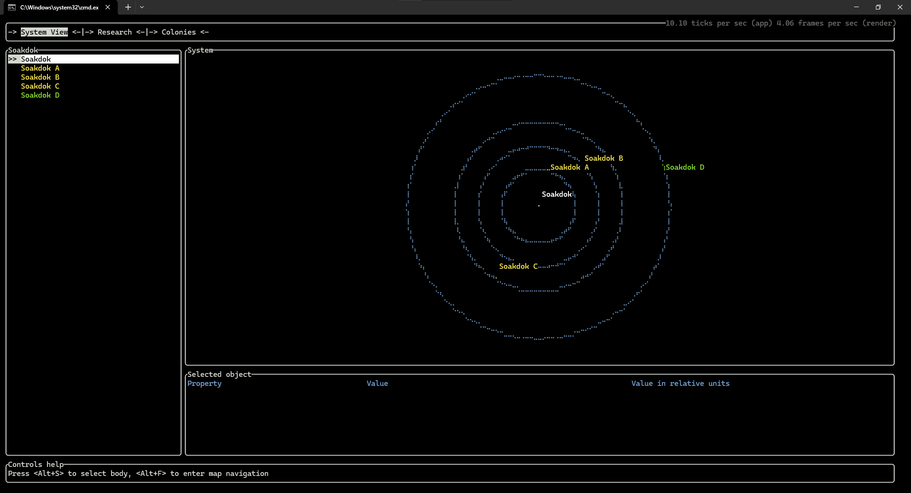

# <p align="center"> </p>

## TUI-based space strategy game


<a href="https://discord.com/invite/wP3mtUtKFz"></a>

## 🧐 Features
- Unique UI design
- Fully customisable spaceships and spaceship parts (coming soon)
- Real orbit calculations and maneuvers (coming soon)

## 🛠️ Installation
```
1. Download the latest release from GitHub
2. Unzip the archive
3. Launch the astray.exe file
```

## 🍰 Contributing
Contributions are what make the open source community such an amazing place to learn, inspire, and create. Any contributions you make are **greatly appreciated**.

## ➤ License
Distributed under the MIT License. See [LICENSE](LICENSE) for more information.

## ❤️ Support
A simple star to this project repo is enough to keep me motivated on this project for days.

## Screenshots

