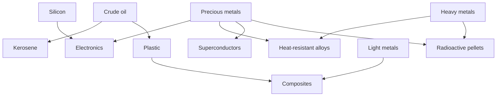
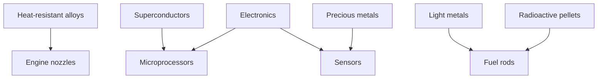

# Resources
## Primary resources
The game has 6 main resource types that can be extracted from planets by
the colonies
- Light metals
- Heavy metals
- Precious metals
- Water
- Crude oil
- Silicon

## Secondary resources
Secondary resources are manufactured by buildings in colonies, not mined, 
unlike primary resources

## Components
Components are manufactured by colonies and are used alongside raw 
secondary resources to build ship modules
